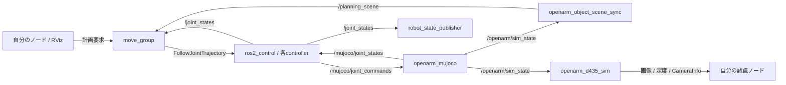

# OpenArm_sim

**OpenArm 1.0 / 2.0を、ROS 2・MoveIt 2・MuJoCoで動かすDocker開発環境です。**

Ubuntu 24.04向けのセットアップ、シミュレーション、物体配置GUI、RGB-Dカメラ、双腕把持デモ、コンテナに接続するVS Code開発環境をまとめています。

| 構成 | 内容 |
|---|---|
| ロボット | OpenArm 1.0 / 2.0（起動時に選択） |
| ソフトウェア | Ubuntu 24.04・ROS 2 Jazzy・MoveIt 2・MuJoCo |
| 描画 | GPUを検査して選択。利用できない場合はCPU描画 |
| 物理計算 | CPUで実行 |
| 物体 | 直方体・500 mLボトル・YCBライブラリ103項目 |
| カメラ | 胸部D435のRGB・深度画像をROSへ配信 |

## OPL 2026 の物体・家具

シーンGUIの **「OPL 2026 物体・家具を開く」** から、Category A の34項目と公開家具14種を選択できます（OpenArm 1.0 / 2.0 共通）。
家具を配置して支持面を選ぶと、物体の高さを自動調整します。衝突・支持面外・物体を載せたままの家具移動／非表示は拒否します。
既存YCBを15項目に再利用し、残りは寸法・質量を仮定した剛体近似です。大会環境の完全再現や、布・液体・家電動作を意味しません。
[出典、近似の制限、操作例](docker/OPL_2026.md) を参照してください。

## 目次

- [はじめに：起動する](#quick-start)
- [GUIで操作する](#gui)
- [よく使うコマンド](#commands)
- [VS Codeで開発する](#development)
- [把持デモを実行する](#demos)
- [起動オプション・オフライン利用](#startup-options)
- [ROS 2開発ガイドとAPI一覧](#ros-development-guide)
- [困ったとき](#ros-troubleshooting)
- [関連資料・ライセンス](#documents)

<a id="quick-start"></a>
## はじめに：起動する

### 必要な環境

Ubuntu 24.04 **amd64（x86_64）**が対象です。Ubuntuの仮想マシンと、RTX 3060 Ti搭載のUbuntu機で検証しています。初回はインターネット接続とsudo権限が必要です。

不足するPython・venv・Git・Docker・Composeは起動スクリプトが導入します。利用可能な既存Dockerは置き換えません。Gitがまだない場合は、GitHubの **Code → Download ZIP** から取得・展開できます。

### 1. リポジトリのフォルダーを開く

**実行場所：ホストUbuntuの端末。** 以下はホーム直下に配置した場合です。別の場所へ展開した場合は、そのフォルダーに移動してください。

```bash
cd ~/OpenArm_sim
```

### 2. 起動する

```bash
/usr/bin/bash start.sh
```

環境チェック後に、画面の案内に従って **1（OpenArm 1.0）** または **2（OpenArm 2.0）** を選びます。初回は依存関係のダウンロードとDockerイメージのビルドに時間がかかります。2回目以降は、ソースが変わらなければ既存イメージを再利用します。

### 3. 起動完了を確認する

次の表示が出たら、制御系の準備が完了です。

```text
All 5 ROS controllers active; simulation ready
```

| 起動した環境 | 表示先 |
|---|---|
| 利用可能なX11 / XWaylandセッションがあるDesktop | ホスト上にRViz・MuJoCo・シーンGUIを表示 |
| GUIセッションがないServer / SSH接続 | ブラウザー表示 |

ブラウザー表示の場合は、Ubuntu機のブラウザーで [シミュレーション画面を開く](http://localhost:6080/vnc.html?autoconnect=true&resize=scale)。別PCの`localhost`はUbuntu機を指しません。

### 4. 短いコマンドを現在の端末にも読み込む

起動時にシェルコマンドが登録されます。すでに開いていた端末では、一度だけ次を実行します。

```bash
source ~/.bashrc
```

以降は[よく使うコマンド](#commands)から操作できます。子プロセスの起動スクリプトから、親ターミナルの関数を直接変更することはできません。

<a id="gui"></a>
## GUIで操作する

### 物体・作業台・カメラ

| やりたいこと | 操作 |
|---|---|
| 作業台を表示する | シーンGUIの作業台切替を使う |
| 直方体・ボトルを置く | 物体を選び、配置する |
| 位置を指定する | 「位置を指定して配置」でX・Y・向きを入力し、「指定位置へ配置」を押す |
| マグカップ・皿などを置く | 「YCB オブジェクトライブラリを開く」で検索・配置する |
| カメラ画像を配信する | D435配信をONにする（初期状態はOFF） |
| 初期状態へ戻す | 「シミュレーションを再起動」を押す |

配置の単位は**X・Yがm、向きが度**です。world座標でXは前方、Yは左方向。高さは机上に自動調整されます。「手前・左」「手前・右」は入力値のプリセットなので、選択後に配置ボタンを押してください。

物体を配置すると作業台も有効になります。作業台を消す前に、把持対象をすべて削除してください。腕を止めてから配置を変更します。机外や他の物体・アームと重なる配置は拒否され、元の位置が保たれます。プリセットは把持成功を保証する位置ではありません。

YCBは両モデル共通で、公式スキャン93項目・修復した近似2項目・代替形状8項目を含みます。マグカップ・平皿・ボウルも利用できます。[形状・力学上の制限](docker/YCB.md)を参照してください。

### RVizで腕を動かす

1. ツールバーで **Interact** を選びます。
2. **MotionPlanning → Planning Request → Query Goal State** を有効にします。
3. 手先マーカーを動かし、**Plan** で経路を確認します。
4. **Execute** で実行します。

視点はRVizの **Move Camera** で左ドラッグ。MuJoCoは左ドラッグで回転、右ドラッグで移動、ホイールで拡大・縮小できます。

<a id="commands"></a>
## よく使うコマンド

**実行場所：ホストUbuntuの端末。** 起動済みのシミュレーションに対して使用します。

### コンテナのターミナルを開く

```bash
oa
```

### コンテナに接続したVS Codeを開く

```bash
oa-code
```

### 環境診断を実行する

**実行場所：ホストUbuntuの端末。** コンテナ停止時にも実行できます。

```bash
oa-doctor
```

GUI上部の「環境診断（読み取り専用）」からも、別ウィンドウに診断結果を表示できます。
「要確認」の直下に、次に確認する場所や操作を表示します。カメラOFFは「正常・待機」です。
診断は修復・再起動・インストールや腕の操作を行いません。

コマンドが見つからない場合は、**Ubuntuホストのリポジトリのフォルダー**で登録します。

```bash
python3 install_shell.py
```

同じ端末で設定を読み込みます。

```bash
source ~/.bashrc
```

登録前に診断する場合は、**Ubuntuホストのリポジトリのフォルダー**で実行します。

```bash
python3 scripts/oa_doctor.py
```

<details>
<summary>診断範囲・所要時間・制限</summary>

- Docker、実行中のOpenArm 1.0/2.0、必要なROSノード、シミュレーション時刻の進行、5コントローラー、モデルに対応する指の関節構成、MoveIt、作業台・物体同期、カメラを確認します。
- カメラをONにした直後は初回描画準備に時間がかかり、診断が時間切れになる場合があります。準備完了後に再診断してください。
- カメラON時はRGB・深度・整列深度の画像時刻の更新を確認します。描画エラーや状態サービスの無応答は、OFFと区別します。
- ROS観測は約7秒、ホスト実行は最大約22秒で打ち切る設計です。コンテナ停止時はROS診断を省略します。終了コード0は正常、1は要確認です。
- 物体位置の許容差は3 cmです。把持中の物体は除外します。移動中は時刻差で警告が出る場合があるため、腕の停止後に再診断してください。
- 同期の一時停止、姿勢・全衝突形状の一致、運動計画の成功までは保証しません。
- GUIではホストDockerデーモンを直接検査できません。Dockerへの接続・停止状態や保存されたモデル設定との一致は、ホストの診断コマンドで確認してください。
- GUI本体はイメージに含まれます。ソース変更の反映にはイメージ再ビルドを伴う次回起動が必要です。オフラインで既存イメージを使う起動では反映されません。

</details>

### ROSノードを一覧表示する

```bash
oa-ros node list
```

### コントローラーの状態を確認する

```bash
oa-ros control list_controllers
```

### 配置中の物体を確認する

```bash
oa-scene status
```

### ログを見る

```bash
oa-logs
```

### シミュレーションを停止する

リポジトリのフォルダーで実行します。

```bash
/usr/bin/bash start.sh --stop
```

<a id="development"></a>
## VS Codeで開発する

### 1. コンテナへ接続する

**ホストUbuntu**で実行します。VS Code本体はあらかじめ導入してください。Dev Containers拡張は必要に応じて導入されます。

```bash
oa-code
```

VS Code左下にコンテナへの接続が表示され、`/workspaces/OpenArm_dev`が開きます。以降は**VS Codeのコンテナ内ターミナル**を使用してください。Git・Python・colcon・C/C++のビルドはコンテナ内で実行されます。

接続先を確認する場合：

```bash
test -f /.dockerenv && echo 'Docker内です'
```

```bash
which ros2
```

### 2. ソースを置く

| 場所 | 用途 |
|---|---|
| `/workspaces/OpenArm_dev/src/` | 自作ROSパッケージや開発リポジトリ |
| `src/openarm_demos/openarm_demos/` | 同梱の把持デモ。配布リポジトリのデモソースへのリンク |
| `environment/` | シミュレーション環境全体のソースへのリンク |
| `/workspaces/OpenArm_sim/` | 配布リポジトリ全体 |

別の開発リポジトリを使う場合は、まず移動します。

```bash
cd /workspaces/OpenArm_dev/src
```

次のURLを自分のリポジトリに置き換えて実行します。

```bash
git clone <repository-url>
```

Gitのユーザー名・メール・非公開リポジトリの認証は開発者ごとに設定してください。ホストのSSH秘密鍵は自動コピーしません。

### 3. ビルドする

```bash
cd /workspaces/OpenArm_dev
```

```bash
colcon build --symlink-install
```

ビルド結果を、実行する端末で読み込みます。

```bash
source install/setup.bash
```

### 保存場所と再ビルドの違い

開発ワークスペースは、ホストの`<checkout>/.openarm/dev_ws`に保存されます。`src`・`build`・`install`・`log`はコンテナ再作成後も残ります。**`.openarm`を削除すると開発データも消えます。** `/opt/openarm`の直接編集や共有フォルダー外のデータは永続化されません。

自作ROSノードとデモは上記のcolconでビルドします。物理ブリッジなどの環境本体や、配布用のOS依存関係を変更した場合は、[イメージの再ビルド](#rebuild)が必要です。

<a id="demos"></a>
## 把持デモを実行する

両モデルで、GUIの **「右手把持デモ」** または **「両腕把持デモ」** を利用できます。停止は **「デモ停止」** です。

**両腕を初期姿勢に戻してから開始してください。** デモは作業台と対象の直方体を配置し、ほかの把持物体を削除します。実行中はRVizや別コードから腕・物体を操作しないでください。中断・失敗後はGUIでシミュレーションを再起動してから再実行します。

<details>
<summary>端末から実行する・デモの判定条件を見る</summary>

**実行場所：ホストUbuntu、リポジトリのフォルダー。**

両腕で、それぞれ別の直方体を持ち上げる：

```bash
bash demo_grasp.sh
```

右腕だけで実行する：

```bash
bash demo_grasp.sh --arms right
```

左腕だけで実行する：

```bash
bash demo_grasp.sh --arms left
```

デモは、接近 → 下降 → 指を閉じる → 持ち上げて保持 → 置き戻す → 初期姿勢へ戻る、の順に動きます。右腕の既知位置はworld X=0.30 m、Y=-0.18 mです。100 gの直方体が開始時より9 cm以上高い状態を約2秒保持した場合に成功と判定します。

MuJoCoでは接触・摩擦で保持します。固定ジョイントや物体の強制追従は使いません。MoveItのAttachedCollisionObjectは計画上の表現です。デモ中だけ指と箱、箱と作業台の接触を許可し、終了・中断時に計画シーン設定を戻します。置き戻し姿勢は物理接触によって変わる場合があります。

これは既知位置の直方体を扱う学習用デモです。画像認識、任意位置・ボトルの自動把持、実機動作は対象外です。[モーター仕様と検証結果](HARDWARE_MODEL.md)を参照してください。

</details>

<details>
<summary>デモのコードを編集・実行する</summary>

VS Codeの`src/openarm_demos/openarm_demos/`にある`grasp_demo.py`と`bimanual_demo.py`を編集します。配布リポジトリの`docker/demos/openarm_demos/openarm_demos/`と同じファイルです。

**実行場所：コンテナ内ターミナル。**

```bash
cd /workspaces/OpenArm_dev
```

```bash
colcon build --symlink-install --packages-select openarm_demos
```

```bash
source install/setup.bash
```

```bash
ros2 run openarm_demos bimanual_demo
```

起動時にもこのパッケージをビルドし、GUIは実行時に開発用overlayを読み込みます。1.0 / 2.0は同じデモコード内のモデル設定で切り替えます。

</details>

<a id="startup-options"></a>
## 起動オプション・オフライン利用

**実行場所：ホストUbuntu、リポジトリのフォルダー。** 次の各コマンドは目的に応じて一つずつ選びます。

<details>
<summary>モデル・表示方法を指定する</summary>

OpenArm 1.0を指定する：

```bash
/usr/bin/bash start.sh --robot-version 1
```

OpenArm 2.0を指定する：

```bash
/usr/bin/bash start.sh --robot-version 2
```

モデル変更時は現在のシミュレーションを終了し、選んだモデルで再起動します。対話入力できない場合の既定モデルは1.0です。

GUIなしで起動する：

```bash
/usr/bin/bash start.sh --headless
```

CPU描画を指定する：

```bash
/usr/bin/bash start.sh --cpu
```

ブラウザー表示にする：

```bash
/usr/bin/bash start.sh --display browser
```

ホストGUIでの表示を必須にする：

```bash
/usr/bin/bash start.sh --display native
```

Desktop / Serverというインストール名ではなく、接続可能なGUIセッションで判定します。GPUはOpenGL検査が通ったときに描画に使用します。物理計算はCPUです。負荷を抑えるため、カメラ配信は必要なときに有効にしてください。[性能設定](PERFORMANCE.md)

</details>

<details>
<summary>オフラインで起動する</summary>

通常起動でも接続を確認し、オフライン時はapt更新・インストール・イメージビルドを省きます。通信確認は最大約8秒です。明示的に通信確認も省く場合：

```bash
/usr/bin/bash start.sh --offline
```

必要なホストパッケージとローカルイメージが揃っていれば起動します。不足していれば理由を表示し、既存コンテナを停止・置き換えする前に終了します。

オフラインでは未ビルドのソース変更は反映されません。オフラインと再ビルドの同時指定はできません。両モデルは同じイメージに含まれるため、ビルド済みならオフラインでも選択できます。

</details>

<details>
<summary>セットアップだけ行う・コマンドを再登録する</summary>

```bash
/usr/bin/bash start.sh --setup-only
```

現在の端末に登録結果を反映する：

```bash
source ~/.bashrc
```

既存の`.bashrc`を保全し、重複しない読み込み行を追加します。新規Docker導入にはUbuntuのdocker.io / docker-compose-v2を使用します。Dockerグループは管理者相当の権限を持ちます。起動スクリプトは当回のグループを再読み込みしますが、別の既存端末で権限エラーが出る場合はUbuntuにログインし直してください。

ホストの`.venv`はランチャー用、コンテナの`/opt/venv`はMuJoCo側のPython環境です。内部処理に必要な`start.py`・`install_shell.py`・`scripts/oa_code.py`も同梱しています。通常の起動入口はシェルスクリプトです。

自動導入はUbuntu 24.04 amd64のみ対応です。Windows / macOSのDocker実行は未検証で、ARM64 / Apple SiliconとリモートDockerは未対応です。同名コンテナ`openarm-auto`を別のクローンが使っている場合は、変更せず終了します。

</details>

<a id="rebuild"></a>
<details>
<summary>環境本体を変更したあとにイメージを再ビルドする</summary>

```bash
/usr/bin/bash start.sh --rebuild
```

物理ブリッジなどの`docker/app/`や、`docker/Dockerfile`に記述した配布用依存関係の変更に使用します。通常の自作ROSパッケージは[コンテナ内でビルド](#development)してください。

</details>

<a id="ros-development-guide"></a>
## 初心者向け ROS 2 開発ガイド

この章は本環境の実装と起動中のROSグラフを照合した説明です（2026-09-16、ROS 2 Jazzy）。OpenArm 1.0/2.0で共通の名前を使いますが、**グリッパーの関節数・単位は異なります**。ここに書かれたTopicがあるだけでは、画像認識や任意物体の自動把持が実装済みという意味ではありません。

- [端末・通信・最初の確認](#ros-first-check)
- [ノードとデータの流れ](#ros-data-flow)
- [トピック一覧](#ros-topics)
- [サービス一覧と物体配置](#ros-services)
- [アクションとグリッパー](#ros-actions)
- [D435画像・深度・TF](#ros-camera)
- [Pythonで最初のノードを作る](#ros-python)
- [新しい機能を追加する場所](#ros-extension)
- [トラブルの切り分け](#ros-troubleshooting)

<a id="ros-first-check"></a>
### 端末・通信・最初の確認

[起動手順](#quick-start)を済ませてから進めます。この章では各操作の実行場所を明記します。ROSのコマンドは **コンテナ内ターミナル**で実行してください。ホストにROSをインストールする必要はありません。

**ホスト側**

```bash
cd ~/OpenArm_sim
```

```bash
bash start.sh
```

起動前から開いていた端末では1度必要。

```bash
source ~/.bashrc
```

```bash
oa
```

**コンテナ内**

```bash
test -f /.dockerenv && echo 'Docker内です'
```

```bash
echo "$ROS_DISTRO / $OPENARM_VERSION / domain=$ROS_DOMAIN_ID"
```

```bash
ros2 node list
```

```bash
ros2 topic list -t
```

```bash
ros2 service list -t
```

```bash
ros2 action list -t
```

```bash
ros2 control list_controllers
```

```bash
ros2 topic echo /joint_states --once
```

5つのコントローラー（joint_state_broadcaster、左右arm、左右gripper）が `active` なら制御系の起動は完了です。これは把持成功やカメラ配信中を意味しません。ホストから一回だけ一覧を取得する場合：

**ホストUbuntu**

```bash
oa-ros topic list -t
```

既定は `ROS_DOMAIN_ID=42`、`ROS_AUTOMATIC_DISCOVERY_RANGE=LOCALHOST`。別コンテナや別PCとの通信は自動では構成していません。最初はすべて同じコンテナ内で開発してください。ROS Domainが違う端末や、ホスト側に別途インストールしたROSからは、そのままでは見えないことがあります。

時刻はMuJoCoが配信する `/clock` が基準です。自分のノードでも `use_sim_time:=true` を指定してください。シミュレーションを再起動すると時刻は0に戻り、進行中のAction、TFのキャッシュ、古い画像との対応は引き継げません。速度表示の `real_time_factor=0.5` は現実の2秒でシミュレーションが1秒進む意味です。

<a id="ros-data-flow"></a>
### ノードとデータの流れ

Topicは継続的なデータ配信、Serviceは一回の要求と応答、Actionは時間のかかる動作の開始・進捗・結果・キャンセルに使います。本環境では状態や画像をTopicで読み、物体配置をServiceに要求し、腕の軌道をActionで実行します。[ROS 2公式の説明](https://docs.ros.org/en/jazzy/How-To-Guides/Topics-Services-Actions.html)



<details>
<summary>ノード一覧と実装ファイル（クリックで開く）</summary>

| ノード | 役割 | 主な実装・設定 |
|---|---|---|
| `/openarm_mujoco` | MuJoCo物理、ロボット関節状態、物体の配置・削除、シミュレーション時刻 | `docker/app/bridge.py`、`physics.py`、`dynamic_objects.py` |
| `/controller_manager` | 制御ハードウェアと各controllerの管理 | 生成される `controllers.yaml`、`generate_config.py` |
| `/mujocotopicsystem` | ros2_controlとMuJoCoのTopic接続 | URDF内のハードウェア設定 |
| `/joint_state_broadcaster` | 制御系が把握している関節状態の配信 | `/joint_states` |
| `/left_arm_controller`、`/right_arm_controller` | 左右7関節の位置軌道追従 | FollowJointTrajectory |
| `/left_gripper_controller`、`/right_gripper_controller` | 指の位置軌道追従 | FollowJointTrajectory |
| `/robot_state_publisher` | URDFと関節状態からTFを生成 | `/tf`、`/tf_static` |
| `/move_group` | IK、衝突判定、経路計画、計画シーン管理、軌道実行 | `simulation.launch.py`、生成MoveIt設定 |
| `/openarm_object_scene_sync` | MuJoCo内の把持物体をMoveIt衝突物体へ同期 | `object_scene_sync.py` |
| `/openarm_d435_sim` | RGB・深度画像、CameraInfo、カメラ固定TF | `camera_node.py`、`camera_config.json` |
| `/rviz` | 表示とMoveItの操作画面 | `docker/app/openarm.rviz` |

</details>

`move_group_private_...`、`transform_listener_impl_...`、`interactive_marker_display_...` など末尾が変化するノードは内部生成名です。コードに固定して書かないでください。シーンGUI自体はTkアプリで、操作の都度CLI経由でROSサービス等を呼びます。

<a id="ros-topics"></a>
### トピック一覧

型のフィールドと、実際の配信元・購読先・QoSを調べる例です。

**コンテナ内**

```bash
ros2 interface show sensor_msgs/msg/JointState
```

```bash
ros2 topic info /joint_states -v
```

<details>
<summary>トピック一覧：型・用途（クリックで開く）</summary>

| Topic | 型 | 方向・用途 |
|---|---|---|
| `/joint_states` | `sensor_msgs/msg/JointState` | 読む：通常の関節状態。自分の制御・監視ノードはこちらを購読 |
| `/dynamic_joint_states` | `control_msgs/msg/DynamicJointState` | 読む：関節ごとのstate interface値を名前付きで取得 |
| `/mujoco/joint_states` | `sensor_msgs/msg/JointState` | 内部：MuJoCo→ros2_controlのフィードバック |
| `/mujoco/joint_commands` | `sensor_msgs/msg/JointState` | 内部：ros2_control→MuJoCoの位置指令。稼働中controllerと競合するため通常は直接publishしない |
| `/clock` | `rosgraph_msgs/msg/Clock` | 読む：シミュレーション時刻 |
| `/openarm/sim_state` | `std_msgs/msg/String` | 読む：時刻、MuJoCo qpos、机と各物体の状態をJSONで配信 |
| `/tf`、`/tf_static` | `tf2_msgs/msg/TFMessage` | 読む：動く座標変換／固定座標変換 |
| `/robot_description`、`/robot_description_semantic` | `std_msgs/msg/String` | 読む：URDF／SRDF。遅れて購読する場合のDurabilityも確認 |
| `/<controller>/controller_state` | `control_msgs/msg/JointTrajectoryControllerState` | 読む：軌道参照値・実測値・誤差。controllerは左右arm/gripperのいずれか |
| `/<controller>/joint_trajectory` | `trajectory_msgs/msg/JointTrajectory` | 書く：軌道Topic入力。結果やキャンセルを追跡する初心者向けコードではActionを推奨 |
| `/<controller>/speed_scaling_input` | `control_msgs/msg/SpeedScalingFactor` | 制御ライブラリの速度スケーリング入力。存在だけで本環境の速度調整が有効とは限らない |
| `/planning_scene` | `moveit_msgs/msg/PlanningScene` | 書く：MoveIt計画シーンの差分入力。物体同期ノードも使用 |
| `/monitored_planning_scene` | `moveit_msgs/msg/PlanningScene` | 読む：MoveItが管理しているシーン。物理世界そのものではない |
| `/planning_scene_world` | `moveit_msgs/msg/PlanningSceneWorld` | 書く：MoveItの環境形状入力 |
| `/collision_object` | `moveit_msgs/msg/CollisionObject` | 書く：MoveIt衝突物体の追加・移動・削除 |
| `/attached_collision_object` | `moveit_msgs/msg/AttachedCollisionObject` | 書く：MoveIt上で手先に付属する物体。MuJoCoへ物理的に固定する指示ではない |
| `/display_planned_path` | `moveit_msgs/msg/DisplayTrajectory` | 読む：RViz表示用の計画軌道。配信されても実行したことにはならない |
| `/display_contacts` | `visualization_msgs/msg/MarkerArray` | 読む：MoveIt接触表示用マーカー |
| `/recognized_object_array` | `object_recognition_msgs/msg/RecognizedObjectArray` | MoveIt側の認識結果入力。標準構成に物体認識器の配信元はない |
| `/trajectory_execution_event` | `std_msgs/msg/String` | MoveIt軌道実行の内部イベント。通常はActionの結果・キャンセルを使う |
| `/pipeline_state` | `moveit_msgs/msg/PipelineState` | 計画処理の状態情報 |
| `/diagnostics` | `diagnostic_msgs/msg/DiagnosticArray` | 診断情報。全機能の正常動作を一括保証するものではない |
| `/rosout`、`/parameter_events` | `rcl_interfaces/msg/Log`、`rcl_interfaces/msg/ParameterEvent` | ノードログ／パラメータ変更通知 |

</details>

このほかcontroller managerの `activity`、`statistics/*`、`introspection_data/*`、各controllerの `transition_event`、RVizのinteractive marker用 `update` / `feedback` があります。ライブラリの版で増減するため、稼働中のトピック一覧を正としてください。画像6トピックは下のカメラ節にまとめています。

`JointState.name` と `position` は同じインデックスで対応します。左右や指が並ぶ順序を固定で仮定せず、`dict(zip(msg.name, msg.position))` のように名前で取得します。回転関節のpositionはrad、速度はrad/s、直動関節はm、m/sです。effortの有無・単位は供給元と関節種類に依存し、実測モータートルクと同一とは限りません。

本環境の物理刻みは0.002秒（500 Hz）、MuJoCo関節状態とclockは100 Hz、sim_stateは5 Hz（いずれもシミュレーション時間に対する設計値）。トピックの配信頻度を実時間で測った値は負荷と購読QoSの影響を受けます。

```bash
ros2 topic echo /joint_states --once
```

```bash
ros2 topic info /joint_states -v
```

Ctrl+Cで終了。

```bash
ros2 topic hz /joint_states
```

```bash
ros2 topic echo /openarm/sim_state --once
```

```bash
ros2 interface show sensor_msgs/msg/JointState
```

`/openarm/sim_state` のJSONは以下の構造です（値は説明用）。`quaternion_wxyz` は **w,x,y,z順**で、ROSのQuaternionフィールド名の並びと取り違えないでください。`qpos` はモデル依存の内部配列なので、配列番号をアプリに固定しないでください。物体位置はシミュレータの正解値であり、画像認識の推定値ではありません。

```json
{
  "time": 12.0,
  "qpos": [],
  "obstacles": true,
  "objects": {
    "box": {
      "enabled": true,
      "position": [0.5, 0.0, 0.2],
      "quaternion_wxyz": [1, 0, 0, 0]
    }
  }
}
```

<a id="ros-services"></a>
### サービス一覧と物体配置

<details>
<summary>サービス一覧：要求・応答（クリックで開く）</summary>

| Service | 型 | 要求と応答・使いどころ |
|---|---|---|
| `/openarm/scene/status` | `std_srvs/srv/Trigger` | `{}` → `success`、`message`内のJSONに机・物体ON/OFFとreal_time_factor |
| `/openarm/set_obstacles` | `std_srvs/srv/SetBool` | `data: true/false` → MuJoCoの**作業台のみ**切替。旧名称だが固定障害物群ではない |
| `/openarm/objects/<key>/set_enabled` | `std_srvs/srv/SetBool` | trueで配置、falseで削除。既にONの物体はtrueだけでは再配置しない |
| `/openarm/objects/<key>/reposition` | `std_srvs/srv/Trigger` | `{}` → ランダム再配置。未表示なら新規配置 |
| `/openarm/objects/<key>/place` | `rcl_interfaces/srv/SetParametersAtomically` | DOUBLEのx,y,yawをちょうど3つ指定。応答は `result.successful` と `result.reason` |
| `/openarm/objects/pause_sync` | `std_srvs/srv/SetBool` | MuJoCo→MoveIt物体同期を一時停止／再開。物理計算や腕は停止しない。通常は把持デモが管理 |
| `/openarm/camera/set_enabled` | `std_srvs/srv/SetBool` | D435画像生成のON/OFF。初期OFF |
| `/openarm/camera/status` | `std_srvs/srv/Trigger` | JSONでenabled、error、mount_calibratedを返す |
| `/get_planning_scene` | `moveit_msgs/srv/GetPlanningScene` | componentsで指定した計画シーン要素を取得 |
| `/apply_planning_scene` | `moveit_msgs/srv/ApplyPlanningScene` | シーン差分を適用、`success`を確認。結果が必要なアプリではTopicへの投げっぱなしより扱いやすい |
| `/plan_kinematic_path` | `moveit_msgs/srv/GetMotionPlan` | 制約を満たす軌道を計画。計画だけで腕は動かない |
| `/compute_cartesian_path` | `moveit_msgs/srv/GetCartesianPath` | 手先waypoint列の経路。戻り値fractionが1未満なら全区間に成功していない |
| `/compute_ik` | `moveit_msgs/srv/GetPositionIK` | 手先姿勢→関節角。衝突条件・seed・group名を設定しerror_codeを確認 |
| `/compute_fk` | `moveit_msgs/srv/GetPositionFK` | 関節状態→リンク姿勢 |
| `/check_state_validity` | `moveit_msgs/srv/GetStateValidity` | 指定状態の衝突・制約成立を検査。2姿勢間の経路全体の検査ではない |
| `/controller_manager/list_controllers` | `controller_manager_msgs/srv/ListControllers` | controller名・型・active状態を確認 |
| `/controller_manager/list_hardware_interfaces` | `controller_manager_msgs/srv/ListHardwareInterfaces` | state/command interfaceとclaimed状態を確認 |
| `/<controller>/query_state` | `control_msgs/srv/QueryTrajectoryState` | 軌道の指定時刻の参照状態を問い合わせ |

</details>

その他の管理用Serviceには、controllerのload/configure/switch/unload、`/query_planner_interface`、`/get_planner_params`、`/set_planner_params`、`/get_urdf`、`/save_geometry_to_file`、`/load_geometry_from_file`、`/save_map`、`/load_map`、`/clear_octomap` があります。実在することと、その機能に必要な認識・地図生成ノードが起動済みであることは別です。 本環境では物体形状を直接MoveItへ同期するため、深度画像からのOctomap更新は明示的に無効化しています。各ノードの `get_parameters` 等はROS標準の管理APIです。

`<key>` は `box`、`box_left`、`bottle`、またはYCBキー（例 `ycb_025_mug`、`ycb_029_plate`）。カタログのハイフンはアンダースコアになります。全103項目のkeyと由来は `docker/vendor/ycb/catalog.json` にあります。

**GUIまたはoa-sceneが基本の入口です。** これらは机をMuJoCoとMoveItの両方へ反映します。`/openarm/set_obstacles` を直接呼ぶだけではMuJoCo側のみ変わり、MoveItの作業台は追加されません。把持物体は同期ノードが追従しますが、机は `scene_cli.apply()` または `/apply_planning_scene` による更新が別途必要です。

**ホスト端末から（GUIと同じ操作経路）**

```bash
oa-scene status
```

```bash
oa-scene ycb_025_mug-place --x 0.50 --y 0.0 --yaw 30
```

```bash
oa-scene ycb_025_mug-off
```

**以下はoa内。最初に机を両方の世界に追加**

```bash
python /opt/openarm/app/scene_cli.py on
```

```bash
ros2 service call /openarm/scene/status std_srvs/srv/Trigger '{}'
```

```bash
ros2 service call /openarm/objects/box/set_enabled std_srvs/srv/SetBool '{data: true}'
```

```bash
ros2 service call /openarm/objects/box/place rcl_interfaces/srv/SetParametersAtomically \
  '{parameters: [{name: x, value: {type: 3, double_value: 0.5}}, {name: y, value: {type: 3, double_value: 0.0}}, {name: yaw, value: {type: 3, double_value: 0.0}}]}'
```

```bash
ros2 service call /openarm/objects/box/set_enabled std_srvs/srv/SetBool '{data: false}'
```

type=3はPARAMETER_DOUBLEです。位置はm、**Serviceのyawはrad、GUI/oa-sceneのyawは度**です。高さは物体形状に応じて机上へ自動調整します。物体の姿勢変更はテレポートによる再配置なので、腕を停止してから使います。机外・他物体との重なりなどはエラーになり、元の配置を保ちます。ROS呼び出しが返ったことだけで成功とせず、`success` または `result.successful` を確認してください。

机は全把持物体を削除してから非表示にします。`pause_sync=true` のまま自分のノードが終了すると計画シーンが古いままになるため、例外処理でもfalseへ戻す設計が必要です。シミュレーション全体の再起動はGUIのボタンを使います。現在、公開ROSサービスとして `/openarm/reset` はありません。`/rviz/reset_time` はRViz内の時刻処理用で、物理リセットではありません。

<a id="ros-actions"></a>
### アクションとグリッパー

<details>
<summary>アクション一覧（クリックで開く）</summary>

| Action | 型 | 意味 |
|---|---|---|
| `/left_arm_controller/follow_joint_trajectory` | `control_msgs/action/FollowJointTrajectory` | 左腕7関節の軌道実行 |
| `/right_arm_controller/follow_joint_trajectory` | 同上 | 右腕7関節の軌道実行 |
| `/left_gripper_controller/follow_joint_trajectory` | 同上 | 左指の開閉 |
| `/right_gripper_controller/follow_joint_trajectory` | 同上 | 右指の開閉 |
| `/move_action` | `moveit_msgs/action/MoveGroup` | MoveItへ制約付きの計画・実行要求 |
| `/execute_trajectory` | `moveit_msgs/action/ExecuteTrajectory` | MoveItで得たRobotTrajectoryの実行 |

</details>

左右armは `openarm_left_joint1`〜`7`、`openarm_right_joint1`〜`7` を使用します。全7関節を名前と位置の対応付きで指定してください。現在 `allow_partial_joints_goal=false` です。Actionに直接軌道を送ると**MoveItによる経路衝突チェックを経由しません**。通常はMoveItで計画した軌道を実行します。[controllerの公式仕様](https://control.ros.org/jazzy/doc/ros2_controllers/joint_trajectory_controller/doc/userdoc.html)

| モデル・グリッパー | 指令関節 | 単位 | デモでの開く値／閉じる値 |
|---|---|---|---|
| 1.0 左／右 | `openarm_<side>_finger_joint1` と `...joint2` の2つ | m（直動） | 両方0.03／両方0.0 |
| 2.0 左 | `openarm_left_finger_joint1` のみ | rad（回転） | +0.65／0.0 |
| 2.0 右 | `openarm_right_finger_joint1` のみ | rad（回転） | -0.65／0.0 |

2.0のfinger_joint2はmimicで追従するため、独立した指令関節として送らないでください。右と左で開く符号が逆です。値はこのデモの指令値であり、指間距離そのものではありません。実際の関節リストを確認する場合：

**コンテナ内**

```bash
ros2 param get /right_gripper_controller joints
```

次の例は**2.0の右指だけ**を開きます。手が胸部・机・物体に接触しない場所にあり、他のデモやRViz実行が停止している時に使います。初期姿勢付近では開いた指が胴体に触れる場合があるので、初めはGUIの把持デモを使用してください。

```bash
ros2 action send_goal /right_gripper_controller/follow_joint_trajectory \
  control_msgs/action/FollowJointTrajectory \
  '{trajectory: {joint_names: [openarm_right_finger_joint1], points: [{positions: [-0.65], time_from_start: {sec: 3}}]}}' --feedback
```

1.0ならjoint_namesを `[openarm_right_finger_joint1, openarm_right_finger_joint2]`、positionsを `[0.03, 0.03]` に変更します。durationの `time_from_start` は軌道開始からの相対時間です。

コードでは `rclpy.action.ActionClient` の `wait_for_server` → `send_goal_async` → `accepted` 確認 → `get_result_async` → 終了statusとresult.error_code確認、の順に扱います。停止時は受け取ったgoal handleの `cancel_goal_async()` を使用します。CLIをCtrl+Cしただけで動作が確実にキャンセルされると仮定しないでください。

FollowJointTrajectoryの成功値は `error_code=0`。MoveItErrorCodesのSUCCESSは `1` で異なります。代表的なcontrollerエラーはINVALID_GOAL(-1)、INVALID_JOINTS(-2)、OLD_HEADER_TIMESTAMP(-3)、PATH_TOLERANCE_VIOLATED(-4)、GOAL_TOLERANCE_VIOLATED(-5)。到達許容差をむやみに緩める前に、衝突、関節名、単位、時刻、実行前の姿勢を確認してください。

指は物体を挟むと目標の0まで閉じられない場合があります。既存の把持デモは閉じる動作に専用の許容差を設定し、最終的な物体高さ・保持状態も測っています。Action成功だけを把持成功判定に使わないでください。

既存の学習用ソースは `oa-code` → `src/openarm_demos/openarm_demos/` の `grasp_demo.py`、`bimanual_demo.py` です。両腕デモは左右のActionを同じ開始時刻で送り、片方の失敗時に残る動作も停止する処理を含みます。MoveItのgroup名は `left_arm`、`right_arm`、`both_arms`、左右gripper（正確な定義は `$OPENARM_CONFIG/openarm.srdf`）を確認して使用してください。

<a id="ros-camera"></a>
### D435画像・深度・TF

カメラは初期OFFです。Topic名が一覧に見えていても、OFFなら画像は流れません。

```bash
ros2 service call /openarm/camera/set_enabled std_srvs/srv/SetBool '{data: true}'
```

```bash
ros2 service call /openarm/camera/status std_srvs/srv/Trigger '{}'
```

```bash
ros2 topic echo /camera/camera/color/camera_info --once
```

```bash
ros2 topic info /camera/camera/color/image_raw -v
```

```bash
ros2 topic hz /camera/camera/color/image_raw
```

**配信停止**

```bash
ros2 service call /openarm/camera/set_enabled std_srvs/srv/SetBool '{data: false}'
```

<details>
<summary>カメラの全6トピック（クリックで開く）</summary>

| Topic | 型・encoding | 既定サイズ | フレーム・用途 |
|---|---|---|---|
| `/camera/camera/color/image_raw` | `sensor_msgs/msg/Image`、rgb8 | 320×180 | camera_color_optical_frame、RGB画像 |
| `/camera/camera/color/camera_info` | `sensor_msgs/msg/CameraInfo` | 320×180 | RGBの内部パラメータ |
| `/camera/camera/depth/image_rect_raw` | `sensor_msgs/msg/Image`、16UC1 | 424×240 | camera_depth_optical_frame、深度 |
| `/camera/camera/depth/camera_info` | `sensor_msgs/msg/CameraInfo` | 424×240 | 深度側内部パラメータ |
| `/camera/camera/aligned_depth_to_color/image_raw` | `sensor_msgs/msg/Image`、16UC1 | 320×180 | camera_color_optical_frame、RGBと同じ画素座標の深度 |
| `/camera/camera/aligned_depth_to_color/camera_info` | `sensor_msgs/msg/CameraInfo` | 320×180 | RGBに合わせた深度の内部パラメータ |

</details>

既定2 fps、Reliable/Volatile、depth=2。RGBはBGRではありません。深度は**ミリメートルの符号なし16bit**、0は無効値です。メートルへ直すには1000で割ります。既定の有効範囲は0.2〜10 mです。RVizのImage displayでcolor/image_rawを選ぶとリアルタイムに確認できます。

認識結果のRGB画素(u,v)から位置を求める際は、解像度の異なる生depth画像を同じ(u,v)で参照せず、aligned_depth_to_colorを使います。CameraInfo.kからfx,fy,cx,cyを読み、深度Zをmにして `X=(u-cx)*Z/fx`、`Y=(v-cy)*Z/fy` とするとカメラ光学座標の点になります。これは物体表面の一点であり、物体中心や把持姿勢を直接与えるものではありません。

`world` は配置用の固定座標でXがロボット前方、Yが左、Zが上です。光学座標はXが画像右、Yが画像下、Zが前方です。点をMoveItへ渡す前に、画像の `header.frame_id` と `header.stamp` に基づいてTFでworldまたは計画フレームへ変換します。

```bash
ros2 run tf2_ros tf2_echo world camera_color_optical_frame
```

```bash
ros2 run tf2_ros tf2_echo world openarm_right_hand
```

カメラ取付TFは `openarm_body_link0 → camera_link → camera_color_optical_frame / camera_depth_optical_frame`。カメラ取付高は公式規定値ではなく本環境の基準です。mount_calibrated=falseは実機で校正していない意味で、配信失敗ではありません。画像は理想的なレンダリングで、実機D435のノイズ、欠測、露出、librealsense機器認識は再現しません。[詳細](CAMERA_MOUNT.md)

<a id="ros-python"></a>
### Pythonで最初のノードを作る

最初はロボットを動かさず `/joint_states` を読むノードから始めます。以下はコンテナ内でそのまま実行でき、Ctrl+Cで終了します。

<details>
<summary>関節状態を読むPythonサンプル（コピーしてコンテナ内で実行）</summary>

```bash
python - <<'PY'
import rclpy
from rclpy.node import Node
from rclpy.parameter import Parameter
from sensor_msgs.msg import JointState

class JointMonitor(Node):
    def __init__(self):
        super().__init__('my_joint_monitor', parameter_overrides=[
            Parameter('use_sim_time', value=True)])
        self.subscription = self.create_subscription(
            JointState, '/joint_states', self.on_state, 10)
        self.last_log = -1.0

    def on_state(self, msg):
        stamp = msg.header.stamp.sec + msg.header.stamp.nanosec / 1e9
        if self.last_log >= 0 and 0 <= stamp - self.last_log < 1.0:
            return
        self.last_log = stamp
        positions = dict(zip(msg.name, msg.position))
        angle = positions.get('openarm_right_joint1')
        self.get_logger().info(f't={stamp:.2f}s right_joint1={angle} rad')

rclpy.init()
node = JointMonitor()
try:
    rclpy.spin(node)
except KeyboardInterrupt:
    pass
finally:
    node.destroy_node()
    if rclpy.ok():
        rclpy.shutdown()
PY
```

</details>

Serviceの読み取り例です。サーバー待ち・応答待ちにはタイムアウトを設け、応答の成功フラグも確認します。

<details>
<summary>物体の状態を問い合わせるPythonサンプル（コピーしてコンテナ内で実行）</summary>

```bash
python - <<'PY'
import json
import rclpy
from std_srvs.srv import Trigger

rclpy.init()
node = rclpy.create_node('my_scene_query')
client = node.create_client(Trigger, '/openarm/scene/status')
try:
    if not client.wait_for_service(timeout_sec=5.0):
        raise RuntimeError('シミュレーションのサービスが見つかりません')
    future = client.call_async(Trigger.Request())
    rclpy.spin_until_future_complete(node, future, timeout_sec=5.0)
    if not future.done():
        raise TimeoutError('状態取得がタイムアウトしました')
    result = future.result()
    if not result.success:
        raise RuntimeError(result.message)
    state = json.loads(result.message)
    active = [key for key, enabled in state['objects'].items() if enabled]
    print('配置中:', active)
    print('速度:', state['performance']['real_time_factor'])
finally:
    node.destroy_node()
    rclpy.shutdown()
PY
```

</details>

処理をパッケージ化する場合は、oa-codeの端末で次を実行します。

```bash
cd /workspaces/OpenArm_dev/src
```

```bash
ros2 pkg create --build-type ament_python my_openarm_module \
  --dependencies rclpy sensor_msgs std_srvs
```

**my_openarm_module/ のPythonファイルとsetup.pyのconsole_scriptsを編集**

```bash
cd /workspaces/OpenArm_dev
```

```bash
colcon build --symlink-install --packages-select my_openarm_module
```

```bash
source install/setup.bash
```

**console_scriptsへ登録した実行名を使う**

console_scriptsへ実行名を登録した後の実行例：

```bash
ros2 run my_openarm_module joint_monitor --ros-args -p use_sim_time:=true
```

パッケージ名・実行名を登録しただけでは自動起動されません。最初はoa-codeの別ターミナルでシミュレーションとは別に実行します。依存パッケージはpackage.xmlにも記録してください。

<a id="ros-extension"></a>
### 新しい機能を追加する場所

| 作りたいもの | 主な入力 | 出力・接続先 | 編集場所の例 |
|---|---|---|---|
| 関節監視・ログ | joint_states、controller_state | 自分のログ／診断 | OpenArm_dev/srcの自作ROSパッケージ |
| 画像認識 | RGB、aligned depth、CameraInfo、TF | 物体の推定姿勢 | 同上。任意の認識結果型を決める |
| 把持計画 | 推定姿勢、MoveIt scene、関節状態 | MoveGroup/軌道Action | 同上。既存デモを参考に衝突設定と結果判定も実装 |
| 物体・家具の定義 | 寸法、メッシュ、質量 | MuJoCoとMoveItの両方 | environment_assets.py、scene_objects.py、同期コード |
| GUIの操作追加 | ユーザー入力 | scene_cli等の操作要求 | scene_panel.py、ycb_panel.py |
| カメラ条件の変更 | 画角、解像度、fps | 画像とCameraInfo | camera_config.json、camera_mount.py |
| 配布するOS依存追加 | apt/pip依存 | Dockerイメージ | docker/Dockerfile、requirements.txt |

URDF/SRDF/controllers.yaml等はイメージ内の `$OPENARM_CONFIG` に生成されます。永続的に変更する場合は生成結果を直接書き換えるのでなく `generate_config.py` 等の入力・生成処理を変更し、ホストで[イメージを再ビルド](#rebuild)します。普段の自作ノードやデモの編集は開発ワークスペースでcolcon buildします。

<a id="ros-troubleshooting"></a>
### トラブルの切り分け

| 症状 | 最初の確認と対処 |
|---|---|
| ros2: command not found | ホスト端末ならoaへ入る。oa-codeの左下がDev Container接続か確認 |
| oa / oa-codeがない | [セットアップ・コマンド再登録](#startup-options)を行う |
| 自作パッケージが見つからない | [開発手順](#development)に従ってビルドし、同じ端末で結果を読み込む |
| ノード／サービスが見えない | コンテナ・ROS_DOMAIN_ID・起動完了を確認。[ノード確認・ログ表示](#commands)を使う |
| カメラTopicはあるが画像が来ない | カメラON、camera/status.error、購読QoSを確認。初回レンダラー準備には時間がかかる |
| 深度から求めた距離が1000倍 | 16UC1のmmをmへ変換したか確認。0は無効 |
| 物体位置がカメラの右下方向にずれる | optical frameをworld座標として扱っていないか、画像と深度の解像度・時刻が対応しているか確認 |
| MoveIt上だけ物体がある／ない | MuJoCoとPlanningSceneは別管理。物体同期と机のapply処理を確認 |
| 指が動かない／反対に動く | OPENARM_VERSION、controllerのjoints、1.0のmと2.0のrad、左右の符号を確認 |
| Actionが拒否／到達しない | エラーコード、初期姿勢、関節リスト、衝突、controller_stateの誤差を調べる |
| 初期姿勢へ戻らない | 開いた指の胸部接触などを確認。GUI再起動で全体を初期化。途中姿勢からデモを重ねて実行しない |
| シミュレーションが遅い | scene/statusのreal_time_factor、カメラOFF、GPU判定ログを確認。シミュレーションHzと実時間Hzを区別 |
| 再起動後TF/Actionが不調 | 自作ノードも再起動し、古いgoalや画像を破棄。use_sim_timeを揃える |

より詳しい型のフィールドを調べる場合：

**コンテナ内**

```bash
ros2 interface show moveit_msgs/srv/GetMotionPlan
```

[ROS 2 JazzyのCLIチュートリアル](https://docs.ros.org/en/jazzy/Tutorials/Beginner-CLI-Tools.html)も併用してください。

<a id="documents"></a>
## 関連資料・ライセンス

| 資料 | 内容 |
|---|---|
| [環境インターフェース](ENVIRONMENT.md) | カメラ・座標・物体サービス・近似の範囲 |
| [D435取付寸法図](CAMERA_MOUNT.md) | 公式マウントに基づく寸法と本環境の基準高さ |
| [ハードウェアモデル](HARDWARE_MODEL.md) | モーター仕様・力の換算・把持検証 |
| [OpenArm 2.0](OPENARM_2.md) | モデル差分とデモ |
| [性能と再起動](PERFORMANCE.md) | GPU設定・制御・GUI再起動 |
| [起動の検証](LAUNCHER_VALIDATION.md) | ランチャーの検証内容 |
| [YCBライブラリ](docker/YCB.md) | 収録物体・近似形状・制限 |
| [第三者ライセンス](docker/THIRD_PARTY.md) | 依存パッケージ・モデルの出典 |
| [モデルのライセンス](docker/vendor/LICENSE) | 同梱モデルの利用条件 |

D435は公式マウント形状に基づきますが、取付高さ740 mmは本環境で定めた基準で、公式指定の絶対位置ではありません。実機との一致には取付・校正が必要です。

ロボットモデルはenactic/openarm_mujocoの固定コミットを使用しています。イメージの配布方法と利用条件は、上記の関連資料を確認してください。
