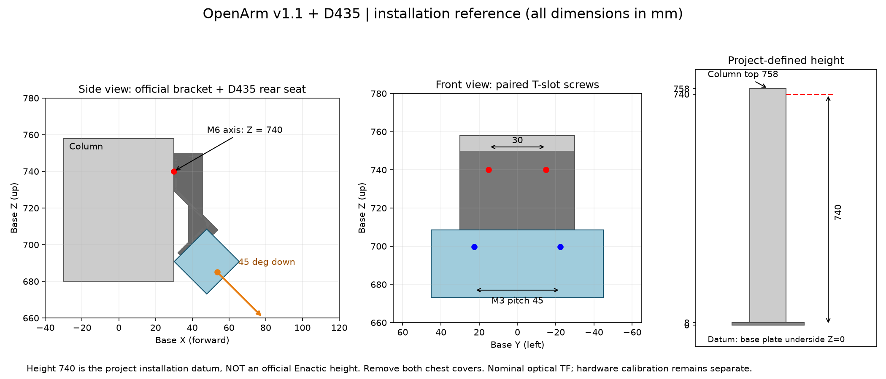

# D435胸部マウントの取付基準

この環境はOpenArm v1.1の公式D435マウント形状を使用します。支柱上の高さには公式の数値指定が見つからないため、ユーザーの選択により **M6ネジ軸高さ740 mm** を本プロジェクトの組立基準として定義しました。公式指定高さではありません。

## 実機の取付寸法

基準座標はベース板下面をZ=0、前方X、左方Y、上方Z。

| 対象 | X mm | Y mm | Z mm | 根拠 |
|---|---:|---:|---:|---|
| 支柱前面 | 30 | — | — | 使用中の公式OpenArm v1モデル |
| 左右M6ネジ軸 | 30 | ±15 | 740 | 穴間隔30は公式マウントCAD、高さ740は本環境の定義 |
| カメラ背面M3穴中心 | 39.000357 | ±22.5 | 699.665119 | 公式STEPの取付面と45 mm穴間隔から導出 |
| camera_link / 深度基準 | 53.672823 | 17.5 | 684.992653 | D435公式URDFの公称光学オフセット |
| RGB光学中心 | 53.672823 | 32.5 | 684.992653 | 同URDFの深度→RGB公称15 mmオフセット |

前方に対して45°下向き。M6ネジ軸は支柱上端758 mmから18 mm下です。胸部カバーは前後とも取り外します。支柱の左右T溝へM6ネジでマウントを固定し、D435背面の2つのM3穴をマウントへ合わせます。ネジ長・締付トルクはこの資料で新たに規定していません。

## 公式資料と導出

- [OpenArm設計者の説明（M3/M6・胸部カバー取り外し）](https://github.com/enactic/openarm/issues/307#issuecomment-3431800678)
- [公式ハードウェア1.1.0](https://github.com/enactic/openarm_hardware/releases/tag/1.1.0): Attachments/chest-camera_D435.step
- [公式CAD索引](https://github.com/enactic/openarm_hardware/blob/1.1.0/dev/google-drive-files/file-ids.tsv)
- [RealSense D435公式URDF](https://github.com/realsenseai/realsense-ros/blob/9a11121700cb4780e273e34141f6402fe184321d/realsense2_description/urdf/_d435.urdf.xacro)

STEPローカル座標(mm)ではM6穴軸が(X,Y,Z)=(40.334880912903,0,15/45)、D435背面取付面はX-Y=-9.000357133747。M3穴軸がこの面と交わる点は(0,9.000357133747,7.5/52.5)。

CAD→ベース軸変換は(Xcad,Ycad,Zcad)→(Zbase,Xbase,Ybase)。平行移動(mm)は(30,-30,740-40.334880912903)。これにより支柱前面、T溝と2つのM6穴、D435背面のM3穴が一致します。

D435前面から深度基準まで4.3 mm、前面中央から深度基準へのYオフセット17.5 mm、深度基準からRGB基準までY方向15 mmはRealSense公式URDFの**公称値**です。個体ごとの校正値ではありません。実機の内部校正・外部校正は別途必要で、calibration_verifiedはfalseを維持しています。

高さはdocker/app/camera_config.jsonのmount_reference.m6_axis_height_mで設定し、再ビルドします。カメラ位置を別々に手入力せず、camera_mount.pyからMuJoCo、URDFの形状、画像描画位置、TFを一貫して生成します。

## 形状と検証

公式STEPを0.08 mmのテッセレーション設定でOBJへ変換。D435公式DAEから描画用OBJを軽量化しており、描画メッシュは寸法計測の基準にはしません。取付寸法は元STEPと公称URDFから算出しています。

胸部カバーメッシュbody_link0_5を除去し、衝突形状も下部支持台と60×60×750 mm支柱へ分離。カメラ筐体とマウントにも衝突形状があります。M6/M3取付点の一致、45°姿勢、カバー除去、18関節を数値検証しています。

カメラ本体・マウント・支柱は同じ固定ベースに属します。RGB/深度は理想描画で、深度ノイズや透明PETの欠測などは再現しません。

## OpenArm 2.0の胸部干渉対策

2.0の公式ペデスタルは胸部カバーを含む一体STLで、1.0用のメッシュ名によるカバー除去だけではD435が内部に隠れていました。画像の約71%が胸部に遮られることを描画とセグメンテーションで確認しました。

生成時に、固定版STLの独立した胸部シェル成分（Z=613〜773 mm）だけを取り外した派生メッシュを作ります。支柱・ベース・取付金具と腕の座標は維持し、元の公式STLは変更しません。形状が変わり成分を一意に識別できなければ生成を停止します。衝突モデルも、カバーを含む旧凸包から下部支持台と支柱の近似形状へ分けます。下部支持台の近似は1.0と共通です。

D435の取付高・姿勢・RGB/深度光学中心は変更しません。カメラ本体の表示と画像配信ON/OFFは別で、配信OFFでも本体は表示されます。

## 支柱の材質と物理値

支柱のvisualを銀色にし、URDFでは支持部・支柱・D435を材質ごとの表示専用固定リンクに分離する。元の衝突リンク・衝突形状は維持する。v2は胸カバーを除いた既存STLから支柱の連結成分を厳密な境界で分離し、頂点と三角形を変更しない。元STLの法線は全ゼロのため、表示用STLの面法線だけを頂点から再計算する。結合メッシュを分割するとMuJoCoの自動慣性計算が変わるため、分割前の支持部から計算した質量・慣性を明示的に保持する。カメラ座標と光学視界は変更しない。
